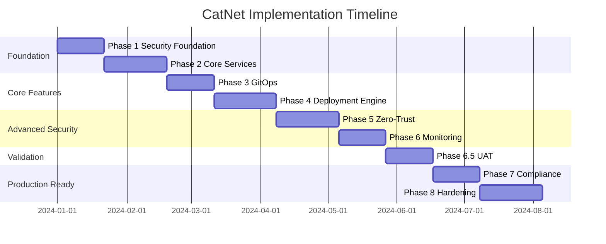

# CatNet Implementation Plan: Security-First SDLC Approach

## Executive Summary

This implementation plan for CatNet (Network Configuration Deployment System) follows a security-first approach through 9 progressive phases including comprehensive User Acceptance Testing. Each phase concludes with a GitHub Actions build validation, ensuring continuous security verification. The plan prioritizes security architecture, zero-trust implementation, UAT validation, and compliance automation while avoiding common anti-patterns.

**Total Project Duration: 34 weeks** (including 3-week contingency buffer)

---

## Phase 1: Security Foundation & Threat Modeling
**Duration: 3 weeks | Priority: CRITICAL**

### 1.1 Security Architecture Setup

#### Vault Infrastructure (Week 1)
```bash
# Directory structure for security components
catnet/
├── security/
│   ├── vault/
│   │   ├── policies/
│   │   ├── auth/
│   │   └── secrets/
│   ├── certificates/
│   │   ├── ca/
│   │   └── mtls/
│   └── threat-models/
```

#### HashiCorp Vault Configuration
```python
# src/security/vault_manager.py
import hvac
from cryptography.fernet import Fernet
from typing import Optional, Dict
import asyncio

class VaultManager:
    """
    CRITICAL: This is the foundation of all security operations.
    Never bypass this for credential management.
    """
    
    def __init__(self):
        self.client = None
        self.encryption_key = None
        self.audit_logger = AuditLogger()
        
    async def initialize_vault(self) -> None:
        """Initialize Vault with security policies"""
        self.client = hvac.Client(
            url=os.getenv('VAULT_ADDR'),
            token=self.get_bootstrap_token()  # One-time use only
        )
        
        # Enable audit logging first
        await self.enable_audit_logging()
        
        # Setup authentication methods
        await self.setup_auth_methods()
        
        # Create security policies
        await self.create_policies()
        
        # Enable secret engines
        await self.enable_secret_engines()
        
    async def enable_audit_logging(self) -> None:
        """Enable comprehensive audit logging"""
        self.client.sys.enable_audit_device(
            device_type='file',
            path='file',
            options={
                'file_path': '/vault/audit/audit.log',
                'hmac_accessor': True,
                'log_raw': False
            }
        )
        
    async def setup_auth_methods(self) -> None:
        """Configure authentication methods"""
        # AppRole for services
        self.client.sys.enable_auth_method('approle')
        
        # OIDC for humans
        self.client.sys.enable_auth_method('oidc')
        
        # Cert auth for devices
        self.client.sys.enable_auth_method('cert')
```

#### Threat Modeling Implementation
```python
# src/security/threat_model.py
from enum import Enum
from dataclasses import dataclass
from typing import List

class ThreatCategory(Enum):
    SPOOFING = "spoofing"
    TAMPERING = "tampering"
    REPUDIATION = "repudiation"
    INFO_DISCLOSURE = "information_disclosure"
    DENIAL_OF_SERVICE = "denial_of_service"
    ELEVATION_OF_PRIVILEGE = "elevation_of_privilege"

@dataclass
class Threat:
    category: ThreatCategory
    description: str
    impact: int  # 1-10
    likelihood: int  # 1-10
    mitigation: str
    status: str = "open"
    
class CatNetThreatModel:
    """STRIDE threat modeling for network automation"""
    
    def __init__(self):
        self.threats = self.identify_threats()
        self.mitigations = self.define_mitigations()
        
    def identify_threats(self) -> List[Threat]:
        return [
            Threat(
                category=ThreatCategory.SPOOFING,
                description="Attacker impersonates network device",
                impact=9,
                likelihood=6,
                mitigation="mTLS with device certificates"
            ),
            Threat(
                category=ThreatCategory.TAMPERING,
                description="Configuration tampering in transit",
                impact=8,
                likelihood=5,
                mitigation="Config signing and encryption"
            ),
            Threat(
                category=ThreatCategory.INFO_DISCLOSURE,
                description="Credential exposure in logs",
                impact=10,
                likelihood=7,
                mitigation="Vault integration, log sanitization"
            ),
            # Add all identified threats...
        ]
```

### 1.2 GitHub Actions Security Pipeline

```yaml
# .github/workflows/phase1-security-foundation.yml
name: Phase 1 - Security Foundation Validation

on:
  push:
    paths:
      - 'src/security/**'
      - 'security/**'

jobs:
  validate-security-foundation:
    runs-on: ubuntu-latest
    steps:
      - uses: actions/checkout@v4
      
      - name: Validate Vault Configuration
        run: |
          # Check no hardcoded secrets
          detect-secrets scan --all-files --force-use-all-plugins
          
      - name: Validate Threat Model
        run: |
          python -m pytest tests/security/test_threat_model.py
          
      - name: Security Policy Validation
        run: |
          opa test security/policies/*.rego
          
      - name: mTLS Certificate Validation
        run: |
          openssl verify -CAfile security/certificates/ca/ca.crt \
            security/certificates/mtls/*.crt
```

### Phase 1 Success Criteria
- [ ] Vault deployed and configured
- [ ] All auth methods operational
- [ ] Threat model documented and reviewed
- [ ] Zero hardcoded credentials
- [ ] mTLS certificates generated
- [ ] Audit logging enabled
- [ ] GitHub Actions passing

---

## Phase 2: Core Security Services
**Duration: 4 weeks | Priority: CRITICAL**

### 2.1 Authentication Service Implementation

```python
# src/api/auth_service.py
from fastapi import FastAPI, Depends, HTTPException, Security
from fastapi.security import OAuth2PasswordBearer, HTTPBearer
import jwt
from passlib.hash import argon2
import pyotp
from typing import Optional

app = FastAPI(title="CatNet Auth Service")
security = HTTPBearer()

class AuthenticationService:
    """
    CRITICAL: Central authentication for all CatNet services
    Implements OAuth2, MFA, and certificate-based auth
    """
    
    def __init__(self):
        self.vault = VaultManager()
        self.audit = AuditLogger()
        self.mfa_enforced = True
        
    async def authenticate_user(
        self, 
        username: str, 
        password: str,
        mfa_token: Optional[str] = None
    ) -> dict:
        """Multi-factor authentication flow"""
        
        # Step 1: Validate credentials
        user = await self.validate_credentials(username, password)
        if not user:
            self.audit.log_failed_auth(username)
            raise HTTPException(401, "Invalid credentials")
        
        # Step 2: Enforce MFA
        if self.mfa_enforced and not mfa_token:
            return {"requires_mfa": True, "session_id": self.create_session(user)}
        
        if self.mfa_enforced:
            if not await self.validate_mfa(user, mfa_token):
                self.audit.log_failed_mfa(username)
                raise HTTPException(401, "Invalid MFA token")
        
        # Step 3: Generate JWT
        token = await self.generate_jwt(user)
        
        # Step 4: Audit successful login
        self.audit.log_successful_auth(username)
        
        return {"access_token": token, "token_type": "bearer"}
    
    async def validate_credentials(self, username: str, password: str) -> Optional[dict]:
        """Validate against LDAP/AD with rate limiting"""
        # Get user from database
        user_hash = await self.get_user_hash(username)
        
        # Verify with argon2 (resistant to timing attacks)
        if not argon2.verify(password, user_hash):
            return None
            
        return await self.get_user_details(username)
    
    async def validate_mfa(self, user: dict, token: str) -> bool:
        """Validate TOTP MFA token"""
        secret = await self.vault.get_mfa_secret(user['id'])
        totp = pyotp.TOTP(secret)
        
        # Allow 1 window drift for time sync issues
        return totp.verify(token, valid_window=1)
    
    async def generate_jwt(self, user: dict) -> str:
        """Generate short-lived JWT token"""
        payload = {
            "sub": user['id'],
            "username": user['username'],
            "roles": user['roles'],
            "exp": datetime.utcnow() + timedelta(minutes=15),
            "iat": datetime.utcnow(),
            "jti": str(uuid.uuid4())  # Unique token ID for revocation
        }
        
        # Get signing key from Vault
        signing_key = await self.vault.get_jwt_signing_key()
        
        return jwt.encode(payload, signing_key, algorithm="RS256")

@app.post("/auth/login")
async def login(credentials: LoginRequest):
    """Public login endpoint with rate limiting"""
    service = AuthenticationService()
    return await service.authenticate_user(
        credentials.username,
        credentials.password,
        credentials.mfa_token
    )

@app.post("/auth/device")
async def device_auth(cert: str = Depends(verify_device_cert)):
    """Certificate-based device authentication"""
    # Validate device certificate against CA
    if not validate_device_certificate(cert):
        raise HTTPException(401, "Invalid device certificate")
    
    # Generate device-specific token
    return generate_device_token(cert.subject)
```

### 2.2 Device Security Layer

```python
# src/devices/secure_connector.py
import asyncio
from netmiko import ConnectHandler
from contextlib import asynccontextmanager
import asyncssh

class SecureDeviceConnector:
    """
    PATTERN: Never store device credentials
    Always use temporary, audited connections
    """
    
    def __init__(self):
        self.vault = VaultManager()
        self.audit = AuditLogger()
        self.session_recorder = SessionRecorder()
        
    @asynccontextmanager
    async def connect_to_device(
        self, 
        device_id: str, 
        user_context: dict,
        record_session: bool = True
    ):
        """Secure device connection with automatic cleanup"""
        
        connection = None
        session_id = None
        
        try:
            # Get temporary credentials (30 min TTL)
            creds = await self.vault.get_device_credentials(
                device_id=device_id,
                requestor=user_context['user_id'],
                ttl=1800
            )
            
            # Start session recording
            if record_session:
                session_id = await self.session_recorder.start(
                    device_id, 
                    user_context
                )
            
            # Establish connection through bastion
            connection = await self._establish_connection(
                device_id, 
                creds,
                session_id
            )
            
            # Log connection established
            await self.audit.log_device_access(
                user=user_context['user_id'],
                device=device_id,
                action="connect",
                session=session_id
            )
            
            yield connection
            
        finally:
            # Always cleanup
            if connection:
                await connection.disconnect()
            
            if session_id:
                await self.session_recorder.stop(session_id)
            
            # Revoke temporary credentials
            if creds:
                await self.vault.revoke_credentials(creds['lease_id'])
            
            # Log disconnection
            await self.audit.log_device_access(
                user=user_context['user_id'],
                device=device_id,
                action="disconnect",
                session=session_id
            )
    
    async def _establish_connection(
        self, 
        device_id: str, 
        creds: dict,
        session_id: str
    ):
        """Establish secure SSH connection with recording"""
        
        device_info = await self.get_device_info(device_id)
        
        # Use asyncssh for async operations
        conn = await asyncssh.connect(
            host=device_info['ip'],
            username=creds['username'],
            password=creds['password'],
            known_hosts=None,  # We verify differently
            client_keys=[],  # No persistent keys
            preferred_auth='password',
            login_timeout=30,
            # Record session
            session_factory=lambda: RecordedSSHSession(session_id)
        )
        
        return conn
```

### 2.3 GitHub Actions Validation

```yaml
# .github/workflows/phase2-core-services.yml
name: Phase 2 - Core Services Security

on:
  push:
    paths:
      - 'src/api/**'
      - 'src/devices/**'

jobs:
  validate-auth-service:
    runs-on: ubuntu-latest
    services:
      vault:
        image: vault:latest
        env:
          VAULT_DEV_ROOT_TOKEN_ID: test-token
        options: --cap-add=IPC_LOCK
        
    steps:
      - uses: actions/checkout@v4
      
      - name: Security Scan - Semgrep
        uses: returntocorp/semgrep-action@v1
        with:
          config: >-
            p/security-audit
            p/owasp-top-ten
            p/python
            
      - name: Test Authentication Flow
        run: |
          python -m pytest tests/api/test_auth_service.py \
            --cov=src/api --cov-report=xml
            
      - name: Test MFA Implementation
        run: |
          python -m pytest tests/security/test_mfa.py
          
      - name: Validate JWT Security
        run: |
          python tests/security/validate_jwt_security.py
          
      - name: API Security Testing
        run: |
          docker run --rm \
            -v $(pwd):/zap/wrk:rw \
            -t owasp/zap2docker-stable zap-api-scan.py \
            -t http://localhost:8081/openapi.json \
            -f openapi \
            -r zap_report.html
```

### Phase 2 Success Criteria
- [ ] Authentication service operational
- [ ] MFA fully implemented
- [ ] Device connector with Vault integration
- [ ] Session recording functional
- [ ] Zero persistent credentials
- [ ] API security scan passing
- [ ] 100% test coverage for auth flows

---

## Phase 3: GitOps & Configuration Management
**Duration: 3 weeks | Priority: HIGH**

### 3.1 GitOps Service Implementation

```python
# src/gitops/git_service.py
import asyncio
from typing import Optional, List, Dict
import git
from cryptography.hazmat.primitives import serialization
from cryptography.hazmat.primitives.asymmetric import rsa
from cryptography.hazmat.primitives import hashes
from cryptography.hazmat.primitives.asymmetric import padding
import hashlib
import hmac

class GitOpsService:
    """
    GitOps service with security validation
    """
    
    def __init__(self):
        self.vault = VaultManager()
        self.validator = ConfigValidator()
        self.audit = AuditLogger()
        
    async def process_webhook(self, payload: dict, signature: str) -> dict:
        """Process GitHub webhook with verification"""
        
        # Step 1: Verify webhook signature (CRITICAL)
        if not await self.verify_webhook_signature(payload, signature):
            self.audit.log_security_event("Invalid webhook signature")
            raise SecurityException("Webhook verification failed")
        
        # Step 2: Scan for secrets
        secrets_found = await self.scan_for_secrets(payload['commits'])
        if secrets_found:
            await self.quarantine_commits(secrets_found)
            raise SecurityException(f"Secrets detected: {secrets_found}")
        
        # Step 3: Parse configurations
        configs = await self.parse_configurations(payload)
        
        # Step 4: Validate each config
        validation_results = []
        for config in configs:
            result = await self.validator.validate(config)
            validation_results.append(result)
            
            if not result.is_valid:
                await self.notify_validation_failure(result)
                return {"status": "rejected", "reason": result.errors}
        
        # Step 5: Sign validated configurations
        signed_configs = await self.sign_configurations(configs)
        
        # Step 6: Create deployment request
        deployment = await self.create_deployment(
            configs=signed_configs,
            validation=validation_results,
            requires_approval=self.check_approval_required(configs)
        )
        
        return {
            "status": "accepted",
            "deployment_id": deployment.id,
            "requires_approval": deployment.requires_approval
        }
    
    async def verify_webhook_signature(
        self, 
        payload: dict, 
        signature: str
    ) -> bool:
        """Verify GitHub webhook signature"""
        
        # Get webhook secret from Vault
        secret = await self.vault.get_secret('github/webhook-secret')
        
        # Calculate expected signature
        expected = hmac.new(
            secret.encode(),
            json.dumps(payload).encode(),
            hashlib.sha256
        ).hexdigest()
        
        # Constant-time comparison
        return hmac.compare_digest(
            f"sha256={expected}",
            signature
        )
    
    async def scan_for_secrets(self, commits: List[dict]) -> List[str]:
        """Scan commits for hardcoded secrets"""
        
        secrets_found = []
        patterns = [
            r'password\s*=\s*["\'][^"\']+["\']',
            r'api[_-]?key\s*=\s*["\'][^"\']+["\']',
            r'secret\s*=\s*["\'][^"\']+["\']',
            r'token\s*=\s*["\'][^"\']+["\']',
            r'private[_-]?key\s*=\s*["\'][^"\']+["\']',
            r'aws[_-]?access[_-]?key',
            r'BEGIN RSA PRIVATE KEY'
        ]
        
        for commit in commits:
            for pattern in patterns:
                if re.search(pattern, commit['message'] + commit.get('diff', ''), re.IGNORECASE):
                    secrets_found.append({
                        'commit': commit['id'],
                        'pattern': pattern,
                        'author': commit['author']
                    })
        
        return secrets_found
    
    async def sign_configurations(self, configs: List[dict]) -> List[dict]:
        """Digitally sign configurations"""
        
        # Get signing key from Vault
        signing_key = await self.vault.get_signing_key()
        
        signed_configs = []
        for config in configs:
            # Calculate hash
            config_bytes = json.dumps(config, sort_keys=True).encode()
            config_hash = hashlib.sha256(config_bytes).hexdigest()
            
            # Sign the hash
            signature = signing_key.sign(
                config_bytes,
                padding.PSS(
                    mgf=padding.MGF1(hashes.SHA256()),
                    salt_length=padding.PSS.MAX_LENGTH
                ),
                hashes.SHA256()
            )
            
            signed_configs.append({
                **config,
                '_signature': signature.hex(),
                '_hash': config_hash,
                '_signed_at': datetime.utcnow().isoformat(),
                '_signed_by': 'gitops-service'
            })
        
        return signed_configs
```

### 3.2 Configuration Validator

```python
# src/gitops/config_validator.py
from typing import List, Dict, Optional
import yaml
import json
from pydantic import BaseModel, validator
import ipaddress

class NetworkConfig(BaseModel):
    """Pydantic model for network configuration validation"""
    
    vendor: str
    device_type: str
    hostname: str
    interfaces: List[Dict]
    routing: Optional[Dict]
    security: Dict
    
    @validator('vendor')
    def validate_vendor(cls, v):
        allowed = ['cisco', 'juniper']
        if v.lower() not in allowed:
            raise ValueError(f'Vendor must be one of {allowed}')
        return v.lower()
    
    @validator('interfaces')
    def validate_interfaces(cls, v):
        for interface in v:
            # Validate IP addresses
            if 'ip_address' in interface:
                try:
                    ipaddress.ip_interface(interface['ip_address'])
                except ValueError:
                    raise ValueError(f"Invalid IP: {interface['ip_address']}")
            
            # Security: No default passwords
            if 'password' in interface:
                raise ValueError("Passwords cannot be in configuration")
        
        return v
    
    @validator('security')
    def validate_security(cls, v):
        required = ['ssh_version', 'snmp_version', 'acl']
        for field in required:
            if field not in v:
                raise ValueError(f"Security field '{field}' is required")
        
        # Enforce minimum security standards
        if v.get('ssh_version', 0) < 2:
            raise ValueError("SSH version must be 2 or higher")
        
        if v.get('snmp_version', '') == 'v2c':
            raise ValueError("SNMPv2c not allowed, use SNMPv3")
        
        return v

class ConfigValidator:
    """Multi-layer configuration validation"""
    
    def __init__(self):
        self.schema_validator = NetworkConfig
        self.business_rules = BusinessRules()
        self.security_scanner = SecurityScanner()
        
    async def validate(self, config: dict) -> ValidationResult:
        """Comprehensive validation pipeline"""
        
        result = ValidationResult()
        
        # Layer 1: Schema validation
        try:
            validated = self.schema_validator(**config)
        except Exception as e:
            result.add_error(f"Schema validation: {str(e)}")
            return result
        
        # Layer 2: Vendor-specific syntax
        syntax_errors = await self.validate_vendor_syntax(config)
        for error in syntax_errors:
            result.add_error(f"Syntax: {error}")
        
        # Layer 3: Security compliance
        security_issues = await self.security_scanner.scan(config)
        for issue in security_issues:
            if issue.severity == 'critical':
                result.add_error(f"Security: {issue}")
            else:
                result.add_warning(f"Security: {issue}")
        
        # Layer 4: Business rules
        violations = await self.business_rules.check(config)
        for violation in violations:
            result.add_error(f"Business rule: {violation}")
        
        # Layer 5: Conflict detection
        conflicts = await self.detect_conflicts(config)
        for conflict in conflicts:
            result.add_warning(f"Conflict: {conflict}")
        
        result.is_valid = len(result.errors) == 0
        return result
    
    async def validate_vendor_syntax(self, config: dict) -> List[str]:
        """Vendor-specific syntax validation"""
        
        errors = []
        vendor = config.get('vendor')
        
        if vendor == 'cisco':
            # Cisco-specific validations
            for interface in config.get('interfaces', []):
                if not self._validate_cisco_interface_name(interface['name']):
                    errors.append(f"Invalid Cisco interface: {interface['name']}")
                    
        elif vendor == 'juniper':
            # Juniper-specific validations
            if 'set' not in config.get('format', 'set'):
                errors.append("Juniper configs must use 'set' format")
        
        return errors
```

### 3.3 GitHub Actions for GitOps

```yaml
# .github/workflows/phase3-gitops.yml
name: Phase 3 - GitOps Security

on:
  push:
    paths:
      - 'src/gitops/**'
      - 'configs/**'

jobs:
  validate-gitops:
    runs-on: ubuntu-latest
    steps:
      - uses: actions/checkout@v4
      
      - name: Validate No Secrets in Configs
        run: |
          detect-secrets scan configs/ --all-files
          
      - name: Validate Configuration Schema
        run: |
          python -m pytest tests/gitops/test_config_validator.py
          
      - name: Test Webhook Security
        run: |
          python tests/gitops/test_webhook_security.py
          
      - name: Verify Config Signing
        run: |
          python tests/gitops/test_config_signing.py
          
      - name: Policy Validation with OPA
        run: |
          opa test policies/gitops/*.rego
```

### Phase 3 Success Criteria
- [ ] GitOps service operational
- [ ] Webhook verification implemented
- [ ] Secret scanning functional
- [ ] Configuration validation complete
- [ ] Digital signing implemented
- [ ] No hardcoded credentials in configs
- [ ] GitHub Actions passing

---

## Phase 4: Deployment Engine & Rollback
**Duration: 4 weeks | Priority: HIGH**

### 4.1 Deployment Service

```python
# src/deployment/deployment_service.py
import asyncio
from enum import Enum
from typing import List, Dict, Optional
from dataclasses import dataclass
import uuid

class DeploymentStrategy(Enum):
    CANARY = "canary"
    ROLLING = "rolling"
    BLUE_GREEN = "blue_green"
    ALL_AT_ONCE = "all_at_once"

@dataclass
class Deployment:
    id: str
    configs: List[Dict]
    strategy: DeploymentStrategy
    devices: List[str]
    stages: List[Dict]
    rollback_points: List[Dict]
    status: str = "pending"
    
class DeploymentService:
    """
    Progressive deployment with automatic rollback
    """
    
    def __init__(self):
        self.vault = VaultManager()
        self.device_connector = SecureDeviceConnector()
        self.validator = DeploymentValidator()
        self.audit = AuditLogger()
        
    async def execute_deployment(
        self, 
        deployment_id: str,
        user_context: dict
    ) -> DeploymentResult:
        """Execute deployment with safety checks"""
        
        deployment = await self.get_deployment(deployment_id)
        
        # Verify approval if required
        if deployment.requires_approval:
            if not await self.verify_approval(deployment, user_context):
                raise UnauthorizedException("Deployment requires approval")
        
        # Execute based on strategy
        if deployment.strategy == DeploymentStrategy.CANARY:
            return await self.execute_canary(deployment, user_context)
        elif deployment.strategy == DeploymentStrategy.ROLLING:
            return await self.execute_rolling(deployment, user_context)
        else:
            raise NotImplementedError(f"Strategy {deployment.strategy} not implemented")
    
    async def execute_canary(
        self, 
        deployment: Deployment,
        user_context: dict
    ) -> DeploymentResult:
        """
        Canary deployment with progressive rollout
        """
        
        stages = [
            {'percentage': 5, 'wait_minutes': 5, 'health_checks': 3},
            {'percentage': 25, 'wait_minutes': 10, 'health_checks': 5},
            {'percentage': 50, 'wait_minutes': 15, 'health_checks': 5},
            {'percentage': 100, 'wait_minutes': 0, 'health_checks': 3}
        ]
        
        deployed_devices = []
        rollback_points = []
        
        for stage in stages:
            # Calculate devices for this stage
            device_count = int(len(deployment.devices) * stage['percentage'] / 100)
            stage_devices = deployment.devices[:device_count]
            new_devices = [d for d in stage_devices if d not in deployed_devices]
            
            self.audit.log_deployment_stage(
                deployment_id=deployment.id,
                stage=stage['percentage'],
                devices=new_devices
            )
            
            # Deploy to new devices
            for device_id in new_devices:
                try:
                    # Create backup first (CRITICAL)
                    backup = await self.backup_device(device_id, user_context)
                    rollback_points.append(backup)
                    
                    # Deploy configuration
                    async with self.device_connector.connect_to_device(
                        device_id, 
                        user_context
                    ) as conn:
                        await self.apply_configuration(
                            conn, 
                            deployment.configs,
                            device_id
                        )
                    
                    # Immediate validation
                    health = await self.validate_device_health(
                        device_id, 
                        checks=stage['health_checks']
                    )
                    
                    if not health.is_healthy:
                        raise HealthCheckFailed(
                            f"Device {device_id} failed health check: {health.errors}"
                        )
                    
                    deployed_devices.append(device_id)
                    
                except Exception as e:
                    # AUTOMATIC ROLLBACK
                    self.audit.log_deployment_failure(
                        deployment_id=deployment.id,
                        device=device_id,
                        error=str(e)
                    )
                    
                    await self.execute_rollback(
                        deployed_devices,
                        rollback_points,
                        user_context
                    )
                    
                    raise DeploymentFailed(
                        f"Failed at {stage['percentage']}% stage: {e}"
                    )
            
            # Wait and monitor (except for last stage)
            if stage['wait_minutes'] > 0:
                await self.monitor_deployment(
                    deployed_devices,
                    duration_minutes=stage['wait_minutes']
                )
        
        return DeploymentResult(
            success=True,
            deployed_devices=deployed_devices,
            deployment_id=deployment.id
        )
    
    async def backup_device(
        self, 
        device_id: str,
        user_context: dict
    ) -> Dict:
        """Create encrypted device backup"""
        
        backup_id = str(uuid.uuid4())
        
        async with self.device_connector.connect_to_device(
            device_id, 
            user_context,
            record_session=False  # No recording for backup
        ) as conn:
            # Get running config
            config = await conn.send_command("show running-config")
            
            # Encrypt backup
            encrypted = await self.encrypt_backup(config)
            
            # Store in secure location
            backup_path = await self.store_backup(
                device_id,
                backup_id,
                encrypted
            )
            
            self.audit.log_backup_created(
                device=device_id,
                backup_id=backup_id,
                user=user_context['user_id']
            )
            
            return {
                'device_id': device_id,
                'backup_id': backup_id,
                'path': backup_path,
                'timestamp': datetime.utcnow().isoformat()
            }
    
    async def execute_rollback(
        self, 
        devices: List[str],
        rollback_points: List[Dict],
        user_context: dict
    ):
        """Emergency rollback procedure"""
        
        self.audit.log_rollback_initiated(
            devices=devices,
            user=user_context['user_id']
        )
        
        rollback_results = []
        
        for rollback in rollback_points:
            device_id = rollback['device_id']
            
            try:
                async with self.device_connector.connect_to_device(
                    device_id, 
                    user_context
                ) as conn:
                    # Restore backup
                    backup_config = await self.retrieve_backup(rollback)
                    await self.apply_configuration(
                        conn,
                        backup_config,
                        device_id
                    )
                    
                    # Verify restoration
                    health = await self.validate_device_health(device_id)
                    
                    rollback_results.append({
                        'device': device_id,
                        'status': 'success' if health.is_healthy else 'partial',
                        'health': health
                    })
                    
            except Exception as e:
                rollback_results.append({
                    'device': device_id,
                    'status': 'failed',
                    'error': str(e)
                })
                
                # Critical alert
                await self.send_critical_alert(
                    f"Rollback failed for {device_id}: {e}"
                )
        
        return rollback_results
```

### 4.2 Health Monitoring

```python
# src/deployment/health_monitor.py
from typing import List, Dict
import asyncio
from dataclasses import dataclass

@dataclass
class HealthCheck:
    name: str
    check_function: callable
    critical: bool = False
    timeout: int = 30

class DeviceHealthMonitor:
    """
    Post-deployment health monitoring
    """
    
    def __init__(self):
        self.checks = self.define_health_checks()
        
    def define_health_checks(self) -> List[HealthCheck]:
        return [
            HealthCheck(
                name="connectivity",
                check_function=self.check_connectivity,
                critical=True,
                timeout=10
            ),
            HealthCheck(
                name="interface_status",
                check_function=self.check_interfaces,
                critical=True,
                timeout=15
            ),
            HealthCheck(
                name="routing_table",
                check_function=self.check_routing,
                critical=True,
                timeout=20
            ),
            HealthCheck(
                name="cpu_memory",
                check_function=self.check_resources,
                critical=False,
                timeout=10
            ),
            HealthCheck(
                name="config_compliance",
                check_function=self.check_compliance,
                critical=False,
                timeout=30
            ),
        ]
    
    async def validate_device_health(
        self, 
        device_id: str,
        checks: int = 5
    ) -> HealthResult:
        """Run health checks on device"""
        
        results = HealthResult(device_id=device_id)
        
        for check in self.checks[:checks]:
            try:
                # Run check with timeout
                result = await asyncio.wait_for(
                    check.check_function(device_id),
                    timeout=check.timeout
                )
                
                results.checks[check.name] = result
                
                if not result['success'] and check.critical:
                    results.is_healthy = False
                    results.errors.append(
                        f"{check.name}: {result.get('error', 'Check failed')}"
                    )
                    
            except asyncio.TimeoutError:
                results.is_healthy = False
                results.errors.append(f"{check.name}: Timeout after {check.timeout}s")
                
            except Exception as e:
                results.is_healthy = False
                results.errors.append(f"{check.name}: {str(e)}")
        
        return results
    
    async def check_connectivity(self, device_id: str) -> dict:
        """Verify device is reachable"""
        device = await self.get_device_info(device_id)
        
        # Multiple connectivity tests
        icmp_result = await self.ping_device(device['ip'])
        ssh_result = await self.test_ssh_port(device['ip'], device.get('ssh_port', 22))
        
        return {
            'success': icmp_result and ssh_result,
            'icmp': icmp_result,
            'ssh': ssh_result,
            'latency': await self.measure_latency(device['ip'])
        }
```

### 4.3 GitHub Actions Deployment Validation

```yaml
# .github/workflows/phase4-deployment.yml
name: Phase 4 - Deployment Engine Validation

on:
  push:
    paths:
      - 'src/deployment/**'

jobs:
  validate-deployment-engine:
    runs-on: ubuntu-latest
    
    services:
      test-network:
        image: frrouting/frr:latest
        options: --privileged
        
    steps:
      - uses: actions/checkout@v4
      
      - name: Test Canary Deployment Logic
        run: |
          python -m pytest tests/deployment/test_canary.py -v
          
      - name: Test Rollback Mechanism
        run: |
          python -m pytest tests/deployment/test_rollback.py -v
          
      - name: Test Health Checks
        run: |
          python -m pytest tests/deployment/test_health_monitor.py -v
          
      - name: Deployment Simulation
        run: |
          python tests/deployment/simulate_deployment.py \
            --strategy canary \
            --devices 10 \
            --failure-rate 0.1
          
      - name: Performance Testing
        run: |
          locust -f tests/performance/deployment_load.py \
            --headless \
            --users 50 \
            --spawn-rate 2 \
            --run-time 60s
```

### Phase 4 Success Criteria
- [ ] Deployment service operational
- [ ] Canary deployment working
- [ ] Automatic rollback functional
- [ ] Health monitoring implemented
- [ ] Backup/restore verified
- [ ] Performance targets met
- [ ] GitHub Actions passing

---

## Phase 5: Zero-Trust Network Architecture
**Duration: 4 weeks | Priority: HIGH**

### 5.1 Zero-Trust Implementation

```python
# src/security/zero_trust.py
from typing import Dict, List, Optional
from enum import Enum
import asyncio

class TrustLevel(Enum):
    UNTRUSTED = 0
    LOW = 25
    MEDIUM = 50
    HIGH = 75
    VERIFIED = 100

class ZeroTrustEngine:
    """
    Zero-trust policy engine for network access
    """
    
    def __init__(self):
        self.policy_engine = PolicyEngine()
        self.trust_calculator = TrustCalculator()
        self.enforcement_points = []
        
    async def evaluate_access_request(
        self,
        subject: Dict,  # User or service
        resource: Dict,  # Network device or API
        context: Dict   # Time, location, device state
    ) -> AccessDecision:
        """
        Zero-trust access evaluation
        """
        
        # Step 1: Calculate trust score
        trust_score = await self.calculate_trust_score(
            subject, 
            context
        )
        
        # Step 2: Get resource requirements
        requirements = await self.get_resource_requirements(resource)
        
        # Step 3: Evaluate policies
        policy_result = await self.policy_engine.evaluate(
            subject=subject,
            resource=resource,
            context=context,
            trust_score=trust_score
        )
        
        # Step 4: Make access decision
        if trust_score.value < requirements['minimum_trust']:
            return AccessDecision(
                allowed=False,
                reason=f"Insufficient trust: {trust_score.value} < {requirements['minimum_trust']}"
            )
        
        if not policy_result.allowed:
            return AccessDecision(
                allowed=False,
                reason=policy_result.denial_reason,
                missing_requirements=policy_result.missing
            )
        
        # Step 5: Generate temporary access token
        access_token = await self.generate_access_token(
            subject=subject,
            resource=resource,
            duration=self.calculate_token_duration(trust_score),
            restrictions=self.calculate_restrictions(trust_score)
        )
        
        # Step 6: Audit decision
        await self.audit_access_decision(
            subject=subject,
            resource=resource,
            decision='allowed',
            trust_score=trust_score,
            token=access_token
        )
        
        return AccessDecision(
            allowed=True,
            access_token=access_token,
            expires_in=access_token['duration'],
            restrictions=access_token['restrictions']
        )
    
    async def calculate_trust_score(
        self, 
        subject: Dict, 
        context: Dict
    ) -> TrustLevel:
        """
        Dynamic trust scoring based on multiple factors
        """
        
        factors = {
            'authentication_strength': 0,
            'device_compliance': 0,
            'location_trust': 0,
            'behavior_analysis': 0,
            'time_context': 0
        }
        
        # Authentication strength (0-25 points)
        if subject.get('mfa_verified'):
            factors['authentication_strength'] += 15
        if subject.get('certificate_auth'):
            factors['authentication_strength'] += 10
            
        # Device compliance (0-25 points)
        device = context.get('device', {})
        if device.get('managed'):
            factors['device_compliance'] += 10
        if device.get('patched'):
            factors['device_compliance'] += 10
        if device.get('encrypted'):
            factors['device_compliance'] += 5
            
        # Location trust (0-20 points)
        location = context.get('location', {})
        if location.get('corporate_network'):
            factors['location_trust'] += 20
        elif location.get('country') in self.trusted_countries:
            factors['location_trust'] += 10
            
        # Behavior analysis (0-20 points)
        behavior = await self.analyze_behavior(subject)
        factors['behavior_analysis'] = min(20, behavior['score'])
        
        # Time context (0-10 points)
        if self.is_business_hours(context.get('timestamp')):
            factors['time_context'] += 10
            
        # Calculate total score
        total_score = sum(factors.values())
        
        # Map to trust level
        if total_score >= 90:
            return TrustLevel.VERIFIED
        elif total_score >= 70:
            return TrustLevel.HIGH
        elif total_score >= 50:
            return TrustLevel.MEDIUM
        elif total_score >= 25:
            return TrustLevel.LOW
        else:
            return TrustLevel.UNTRUSTED
```

### 5.2 Microsegmentation

```python
# src/security/microsegmentation.py
class NetworkSegmentation:
    """
    Network microsegmentation for zero-trust
    """
    
    def __init__(self):
        self.segments = self.define_segments()
        self.policies = self.define_policies()
        
    def define_segments(self) -> Dict:
        return {
            'management': {
                'vlan': 10,
                'subnet': '10.0.10.0/24',
                'trust_level': TrustLevel.VERIFIED,
                'services': ['ssh', 'https', 'snmp']
            },
            'production': {
                'vlan': 20,
                'subnet': '10.0.20.0/24',
                'trust_level': TrustLevel.HIGH,
                'services': ['https', 'application']
            },
            'development': {
                'vlan': 30,
                'subnet': '10.0.30.0/24',
                'trust_level': TrustLevel.MEDIUM,
                'services': ['ssh', 'http', 'https']
            },
            'dmz': {
                'vlan': 40,
                'subnet': '10.0.40.0/24',
                'trust_level': TrustLevel.LOW,
                'services': ['https']
            },
            'quarantine': {
                'vlan': 99,
                'subnet': '10.0.99.0/24',
                'trust_level': TrustLevel.UNTRUSTED,
                'services': []
            }
        }
    
    def define_policies(self) -> List[Dict]:
        return [
            {
                'name': 'deny-lateral-movement',
                'source': 'production',
                'destination': 'production',
                'action': 'deny',
                'exceptions': ['load-balancer', 'monitoring']
            },
            {
                'name': 'isolate-quarantine',
                'source': 'quarantine',
                'destination': '*',
                'action': 'deny'
            },
            {
                'name': 'management-access',
                'source': 'management',
                'destination': '*',
                'action': 'allow',
                'conditions': ['mfa_required', 'audit_log']
            }
        ]
    
    async def enforce_segmentation(
        self, 
        device_id: str,
        segment: str
    ):
        """Apply segmentation to network device"""
        
        config = self.generate_segment_config(device_id, segment)
        
        # Apply VLAN configuration
        vlan_config = f"""
        vlan {self.segments[segment]['vlan']}
        name {segment}_segment
        """
        
        # Apply ACLs
        acl_config = self.generate_acl_config(segment)
        
        # Apply to device
        async with self.device_connector.connect_to_device(device_id) as conn:
            await conn.send_config_set([vlan_config, acl_config])
```

### Phase 5 Success Criteria
- [ ] Zero-trust engine operational
- [ ] Trust scoring implemented
- [ ] Microsegmentation configured
- [ ] Policy engine working
- [ ] Dynamic access control
- [ ] Audit logging complete
- [ ] GitHub Actions passing

---

## Phase 6: Monitoring & Observability
**Duration: 3 weeks | Priority: MEDIUM**

### 6.1 Metrics Collection

```python
# src/monitoring/metrics.py
from prometheus_client import Counter, Histogram, Gauge, Info
import time

# Security metrics
auth_attempts = Counter(
    'catnet_auth_attempts_total',
    'Total authentication attempts',
    ['method', 'result']
)

auth_duration = Histogram(
    'catnet_auth_duration_seconds',
    'Authentication duration',
    ['method']
)

active_sessions = Gauge(
    'catnet_active_sessions',
    'Number of active sessions',
    ['type']
)

trust_score_distribution = Histogram(
    'catnet_trust_score',
    'Distribution of trust scores',
    buckets=[0, 25, 50, 75, 100]
)

# Deployment metrics
deployment_duration = Histogram(
    'catnet_deployment_duration_seconds',
    'Time taken for deployment',
    ['strategy', 'result']
)

deployments_total = Counter(
    'catnet_deployments_total',
    'Total deployments',
    ['status', 'vendor']
)

rollbacks_total = Counter(
    'catnet_rollbacks_total',
    'Total rollbacks executed',
    ['reason']
)

# Device metrics
device_connections = Counter(
    'catnet_device_connections_total',
    'Device connection attempts',
    ['vendor', 'result']
)

device_health = Gauge(
    'catnet_device_health_score',
    'Device health score',
    ['device_id', 'vendor']
)

# Security violations
security_violations = Counter(
    'catnet_security_violations_total',
    'Security violations detected',
    ['type', 'severity']
)

class MetricsCollector:
    """
    Centralized metrics collection
    """
    
    def __init__(self):
        self.start_time = time.time()
        
    def record_auth_attempt(self, method: str, success: bool):
        auth_attempts.labels(
            method=method,
            result='success' if success else 'failure'
        ).inc()
        
    def record_deployment(self, strategy: str, status: str, vendor: str):
        deployments_total.labels(
            status=status,
            vendor=vendor
        ).inc()
        
    def record_security_violation(self, violation_type: str, severity: str):
        security_violations.labels(
            type=violation_type,
            severity=severity
        ).inc()
        
        # Alert on critical violations
        if severity == 'critical':
            self.send_security_alert(violation_type)
```

### 6.2 Distributed Tracing

```python
# src/monitoring/tracing.py
from opentelemetry import trace
from opentelemetry.exporter.jaeger import JaegerExporter
from opentelemetry.sdk.trace import TracerProvider
from opentelemetry.sdk.trace.export import BatchSpanProcessor

# Setup tracing
trace.set_tracer_provider(TracerProvider())
tracer = trace.get_tracer(__name__)

# Configure Jaeger exporter
jaeger_exporter = JaegerExporter(
    agent_host_name="localhost",
    agent_port=6831,
)

span_processor = BatchSpanProcessor(jaeger_exporter)
trace.get_tracer_provider().add_span_processor(span_processor)

class TracingMiddleware:
    """
    Distributed tracing for all operations
    """
    
    async def __call__(self, request, call_next):
        with tracer.start_as_current_span(
            f"{request.method} {request.url.path}"
        ) as span:
            # Add request attributes
            span.set_attribute("http.method", request.method)
            span.set_attribute("http.url", str(request.url))
            span.set_attribute("http.scheme", request.url.scheme)
            
            # Add custom attributes
            if hasattr(request.state, "user"):
                span.set_attribute("user.id", request.state.user.id)
            
            try:
                response = await call_next(request)
                span.set_attribute("http.status_code", response.status_code)
                return response
                
            except Exception as e:
                span.record_exception(e)
                span.set_status(trace.Status(trace.StatusCode.ERROR, str(e)))
                raise
```

### Phase 6 Success Criteria
- [ ] Prometheus metrics exposed
- [ ] Grafana dashboards created
- [ ] Distributed tracing enabled
- [ ] Alert rules configured
- [ ] SLIs/SLOs defined
- [ ] Performance baselines established

---

## Phase 6.5: User Acceptance Testing (UAT)
**Duration: 3 weeks | Priority: CRITICAL**

### 6.5.1 UAT Environment Setup

```python
# src/testing/uat_environment.py
from enum import Enum
from dataclasses import dataclass
from typing import List, Dict, Optional

class UATUserRole(Enum):
    NETWORK_ENGINEER = "network_engineer"
    NETWORK_MANAGER = "network_manager"
    SECURITY_AUDITOR = "security_auditor"
    OPERATIONS_LEAD = "operations_lead"
    JUNIOR_ENGINEER = "junior_engineer"

class UATEnvironment:
    """
    Isolated UAT environment mirroring production
    """
    
    def __init__(self):
        self.config = self._load_uat_config()
        
    def _load_uat_config(self) -> Dict:
        return {
            'environment': 'uat',
            'infrastructure': {
                'vault': {
                    'url': 'https://vault-uat.catnet.internal:8200',
                    'namespace': 'uat'
                },
                'database': {
                    'host': 'postgres-uat.catnet.internal',
                    'database': 'catnet_uat'
                }
            },
            'network_devices': {
                'cisco': {'switches': 25, 'routers': 10},
                'juniper': {'switches': 15, 'routers': 5},
                'virtual': {'containerlab': 50, 'gns3': 20}
            }
        }
    
    async def provision_environment(self):
        """Provision complete UAT environment"""
        await self._deploy_infrastructure()
        await self._configure_devices()
        await self._load_test_data()
        await self._verify_environment()
        return True
```

### 6.5.2 UAT Test Scenarios

```python
# src/testing/uat_scenarios.py
@dataclass
class UATScenario:
    id: str
    name: str
    description: str
    actors: List[UATUserRole]
    priority: str  # P0, P1, P2
    acceptance_criteria: List[str]

class UATTestPlan:
    """
    Comprehensive UAT test scenarios for CatNet
    """
    
    def __init__(self):
        self.scenarios = [
            UATScenario(
                id="UAT-001",
                name="Routine VLAN Configuration Update",
                description="Network engineer performs routine VLAN update",
                actors=[UATUserRole.NETWORK_ENGINEER],
                priority="P0",
                acceptance_criteria=[
                    "Deployment completes in < 5 minutes",
                    "All devices updated successfully",
                    "Rollback capability verified"
                ]
            ),
            UATScenario(
                id="UAT-002",
                name="Emergency Configuration Rollback",
                description="Operations lead performs emergency rollback",
                actors=[UATUserRole.OPERATIONS_LEAD],
                priority="P0",
                acceptance_criteria=[
                    "Rollback completes in < 10 minutes",
                    "Zero data loss",
                    "Full audit trail maintained"
                ]
            ),
            UATScenario(
                id="UAT-003",
                name="PCI Compliance Verification",
                description="Auditor runs PCI DSS compliance check",
                actors=[UATUserRole.SECURITY_AUDITOR],
                priority="P0",
                acceptance_criteria=[
                    "Report generation in < 5 minutes",
                    "All PCI requirements checked",
                    "Evidence package complete"
                ]
            ),
            UATScenario(
                id="UAT-004",
                name="Multi-Vendor Deployment",
                description="Deploy configs to Cisco and Juniper devices",
                actors=[UATUserRole.NETWORK_ENGINEER],
                priority="P0",
                acceptance_criteria=[
                    "100% translation accuracy",
                    "Deployment time < 10 minutes",
                    "Vendor parity maintained"
                ]
            ),
            UATScenario(
                id="UAT-005",
                name="Junior Engineer Onboarding",
                description="Junior engineer first configuration",
                actors=[UATUserRole.JUNIOR_ENGINEER],
                priority="P1",
                acceptance_criteria=[
                    "Onboarding in < 2 hours",
                    "Zero errors in sandbox",
                    "User confidence > 7/10"
                ]
            ),
            UATScenario(
                id="UAT-006",
                name="Bulk Device Configuration",
                description="Deploy to 100+ devices simultaneously",
                actors=[UATUserRole.NETWORK_ENGINEER],
                priority="P1",
                acceptance_criteria=[
                    "Deployment rate > 10 devices/minute",
                    "API response time < 500ms",
                    "Zero failed deployments"
                ]
            )
        ]
```

### 6.5.3 UAT Execution Engine

```python
# src/testing/uat_executor.py
class UATExecutor:
    """
    Execute and track UAT scenarios
    """
    
    def __init__(self):
        self.test_plan = UATTestPlan()
        self.environment = UATEnvironment()
        self.results = UATResults()
        
    async def execute_uat_suite(
        self,
        scenario_ids: Optional[List[str]] = None
    ) -> Dict:
        """Execute UAT test suite"""
        
        scenarios = self._select_scenarios(scenario_ids)
        suite_id = self.results.create_suite()
        
        for scenario in scenarios:
            try:
                result = await self._execute_scenario(scenario, suite_id)
                self.results.record_scenario_result(
                    suite_id, scenario.id, result
                )
                
                if result['status'] != 'passed':
                    await self._handle_failure(scenario, result)
                    
            except Exception as e:
                self.results.record_scenario_error(
                    suite_id, scenario.id, str(e)
                )
        
        return self.results.generate_summary(suite_id)
    
    async def _execute_scenario(
        self, scenario: UATScenario, suite_id: str
    ) -> Dict:
        """Execute individual UAT scenario"""
        
        result = {
            'scenario_id': scenario.id,
            'start_time': datetime.utcnow(),
            'status': 'in_progress'
        }
        
        # Execute test steps
        for step in scenario.test_steps:
            step_result = await self._execute_test_step(step, scenario)
            result['steps'].append(step_result)
            
            if not step_result['passed']:
                result['status'] = 'failed'
                break
        
        # Verify acceptance criteria
        if result['status'] == 'in_progress':
            criteria_results = await self._verify_acceptance_criteria(
                scenario.acceptance_criteria
            )
            result['status'] = 'passed' if all(criteria_results.values()) else 'failed'
        
        result['end_time'] = datetime.utcnow()
        return result
```

### 6.5.4 UAT Defect Management

```python
# src/testing/uat_defects.py
from enum import Enum

class DefectSeverity(Enum):
    CRITICAL = "P0"  # System unusable
    HIGH = "P1"      # Major functionality broken
    MEDIUM = "P2"    # Minor functionality issue
    LOW = "P3"       # Cosmetic

class UATDefectManager:
    """Manage defects found during UAT"""
    
    async def create_defect(
        self,
        scenario_id: str,
        description: str,
        severity: DefectSeverity,
        found_by: str,
        evidence: Dict
    ) -> str:
        """Create and track UAT defect"""
        
        defect = {
            'id': self._generate_defect_id(),
            'scenario_id': scenario_id,
            'description': description,
            'severity': severity,
            'status': 'NEW',
            'found_by': found_by,
            'found_date': datetime.utcnow(),
            'evidence': evidence
        }
        
        # Create in issue tracker
        jira_id = await self.jira_client.create_issue(
            project='CATNET',
            issue_type='Bug',
            summary=defect['description'],
            priority=severity.value,
            labels=['UAT', f'scenario-{scenario_id}']
        )
        
        defect['jira_id'] = jira_id
        await self.defect_db.save(defect)
        
        # Alert for critical defects
        if severity == DefectSeverity.CRITICAL:
            await self._notify_critical_defect(defect)
        
        return defect['id']
```

### 6.5.5 UAT Acceptance Criteria

```python
# src/testing/uat_acceptance.py
class UATAcceptanceCriteria:
    """Define and verify UAT acceptance criteria"""
    
    def __init__(self):
        self.criteria = {
            'functional': {
                'scenario_pass_rate': 95,
                'p0_scenario_pass_rate': 100,
                'feature_coverage': 100
            },
            'performance': {
                'api_response_p95': 500,  # ms
                'deployment_time_per_device': 60,  # seconds
                'concurrent_users': 50
            },
            'security': {
                'mfa_working': True,
                'audit_logging_complete': True,
                'rbac_enforced': True
            },
            'usability': {
                'user_satisfaction': 7.5,  # out of 10
                'task_completion_rate': 90  # %
            },
            'defects': {
                'no_critical_open': True,
                'high_defects_max': 3,
                'fix_rate_minimum': 80  # %
            }
        }
    
    async def evaluate_acceptance(
        self, suite_results: Dict
    ) -> Dict:
        """Evaluate if system meets acceptance criteria"""
        
        evaluation = {
            'overall_pass': True,
            'criteria_results': {},
            'blockers': []
        }
        
        for category, criteria in self.criteria.items():
            result = await self._evaluate_category(category, criteria, suite_results)
            evaluation['criteria_results'][category] = result
            
            if not result['passed']:
                evaluation['overall_pass'] = False
                evaluation['blockers'].extend(result['failures'])
        
        return evaluation
```

### 6.5.6 UAT Sign-off Process

```python
# src/testing/uat_signoff.py
class UATSignoff:
    """Manage UAT sign-off process"""
    
    def __init__(self):
        self.approval_chain = [
            {'role': 'Network Operations Lead', 'required': True},
            {'role': 'Security Officer', 'required': True},
            {'role': 'Network Architecture Lead', 'required': True},
            {'role': 'Business Stakeholder', 'required': False}
        ]
    
    async def request_signoff(
        self, suite_id: str, evaluation_results: Dict
    ) -> Dict:
        """Request sign-off from stakeholders"""
        
        signoff_request = {
            'id': str(uuid.uuid4()),
            'suite_id': suite_id,
            'requested_at': datetime.utcnow(),
            'evaluation': evaluation_results,
            'approvals': [],
            'status': 'pending'
        }
        
        for approver in self.approval_chain:
            await self._send_signoff_request(approver, signoff_request)
        
        return signoff_request
```

### 6.5.7 GitHub Actions UAT Validation

```yaml
# .github/workflows/phase6.5-uat.yml
name: Phase 6.5 - User Acceptance Testing

on:
  workflow_dispatch:
    inputs:
      test_suite:
        description: 'UAT Suite to run'
        required: true
        default: 'full'

jobs:
  setup-uat-environment:
    runs-on: ubuntu-latest
    steps:
      - uses: actions/checkout@v4
      
      - name: Provision UAT Environment
        run: |
          python scripts/uat/provision_environment.py
          
      - name: Load Test Data
        run: |
          python scripts/uat/load_test_data.py

  execute-uat-suite:
    needs: setup-uat-environment
    runs-on: ubuntu-latest
    strategy:
      matrix:
        scenario_group: [functional, security, performance, dr]
    
    steps:
      - name: Run UAT Scenarios
        run: |
          python -m pytest tests/uat/test_${{ matrix.scenario_group }}.py \
            --report-format=json \
            --output=uat_results_${{ matrix.scenario_group }}.json
            
      - name: Collect User Feedback
        run: |
          python scripts/uat/collect_feedback.py \
            --scenario-group=${{ matrix.scenario_group }}

  evaluate-uat-results:
    needs: execute-uat-suite
    runs-on: ubuntu-latest
    steps:
      - name: Evaluate Acceptance Criteria
        run: |
          python scripts/uat/evaluate_acceptance.py
          
      - name: Check Go/No-Go Decision
        run: |
          python scripts/uat/check_go_no_go.py
          
      - name: Request Sign-offs
        if: success()
        run: |
          python scripts/uat/request_signoffs.py
```

### Phase 6.5 Success Criteria
- [ ] UAT environment provisioned
- [ ] 95% scenario pass rate
- [ ] All P0 scenarios passing
- [ ] Zero critical defects open
- [ ] User satisfaction > 7.5/10
- [ ] Performance criteria met
- [ ] All stakeholders signed off
- [ ] Go-live decision approved

---

## Phase 7: Compliance & Audit
**Duration: 3 weeks | Priority: MEDIUM**

### 7.1 Compliance Automation

```python
# src/compliance/compliance_engine.py
from typing import Dict, List
import asyncio

class ComplianceEngine:
    """
    Automated compliance checking and reporting
    """
    
    def __init__(self):
        self.frameworks = {
            'pci_dss': PCIDSSCompliance(),
            'soc2': SOC2Compliance(),
            'iso27001': ISO27001Compliance(),
            'nist': NISTCompliance()
        }
        
    async def run_compliance_check(
        self, 
        framework: str,
        scope: List[str]
    ) -> ComplianceReport:
        """
        Run compliance check for specific framework
        """
        
        if framework not in self.frameworks:
            raise ValueError(f"Unknown framework: {framework}")
        
        checker = self.frameworks[framework]
        report = ComplianceReport(framework=framework)
        
        # Run all checks
        for check in checker.get_checks():
            result = await self.execute_check(check, scope)
            report.add_result(result)
        
        # Generate evidence
        evidence = await self.collect_evidence(framework, scope)
        report.attach_evidence(evidence)
        
        # Calculate compliance score
        report.calculate_score()
        
        return report
    
    async def execute_check(self, check: ComplianceCheck, scope: List[str]) -> CheckResult:
        """
        Execute individual compliance check
        """
        
        result = CheckResult(check_id=check.id, check_name=check.name)
        
        for target in scope:
            try:
                # Run the check
                check_result = await check.execute(target)
                
                result.add_target_result(target, check_result)
                
            except Exception as e:
                result.add_target_result(
                    target,
                    {'status': 'error', 'message': str(e)}
                )
        
        return result
    
    async def collect_evidence(
        self, 
        framework: str, 
        scope: List[str]
    ) -> Dict:
        """
        Collect compliance evidence
        """
        
        evidence = {
            'configs': [],
            'logs': [],
            'reports': [],
            'attestations': []
        }
        
        # Collect device configurations
        for device in scope:
            config = await self.get_device_config(device)
            evidence['configs'].append({
                'device': device,
                'config': config,
                'timestamp': datetime.utcnow().isoformat()
            })
        
        # Collect audit logs
        logs = await self.get_audit_logs(
            start_date=datetime.utcnow() - timedelta(days=30),
            end_date=datetime.utcnow()
        )
        evidence['logs'] = logs
        
        # Generate attestations
        attestation = await self.generate_attestation(framework, scope)
        evidence['attestations'].append(attestation)
        
        return evidence
```

### 7.2 Audit System

```python
# src/compliance/audit.py
import hashlib
from typing import Dict, List
import json

class ImmutableAuditLogger:
    """
    Immutable audit logging with integrity protection
    """
    
    def __init__(self):
        self.storage = SecureStorage()
        self.chain = []
        
    async def log_event(self, event: Dict) -> str:
        """
        Log audit event with blockchain-style chaining
        """
        
        # Add metadata
        event['timestamp'] = datetime.utcnow().isoformat()
        event['id'] = str(uuid.uuid4())
        
        # Get previous hash
        previous_hash = self.chain[-1]['hash'] if self.chain else '0'
        
        # Calculate event hash
        event_data = json.dumps(event, sort_keys=True)
        event_hash = hashlib.sha256(
            f"{previous_hash}{event_data}".encode()
        ).hexdigest()
        
        # Create audit record
        audit_record = {
            'event': event,
            'hash': event_hash,
            'previous_hash': previous_hash,
            'index': len(self.chain)
        }
        
        # Store immutably
        await self.storage.store_immutable(audit_record)
        
        # Add to chain
        self.chain.append(audit_record)
        
        return event['id']
    
    async def verify_integrity(self) -> bool:
        """
        Verify audit log integrity
        """
        
        for i, record in enumerate(self.chain):
            # Skip genesis block
            if i == 0:
                continue
            
            # Verify previous hash
            if record['previous_hash'] != self.chain[i-1]['hash']:
                return False
            
            # Verify current hash
            event_data = json.dumps(record['event'], sort_keys=True)
            expected_hash = hashlib.sha256(
                f"{record['previous_hash']}{event_data}".encode()
            ).hexdigest()
            
            if record['hash'] != expected_hash:
                return False
        
        return True
```

### Phase 7 Success Criteria
- [ ] Compliance engine operational
- [ ] All frameworks implemented
- [ ] Evidence collection automated
- [ ] Immutable audit logging
- [ ] Integrity verification working
- [ ] Reports generation automated

---

## Phase 8: Production Hardening
**Duration: 4 weeks | Priority: CRITICAL**

### 8.1 Security Hardening

```python
# src/hardening/security_hardening.py
class ProductionHardening:
    """
    Final security hardening for production
    """
    
    async def harden_system(self):
        """
        Complete hardening checklist
        """
        
        results = {}
        
        # 1. Rotate all credentials
        results['credential_rotation'] = await self.rotate_all_credentials()
        
        # 2. Enable all security features
        results['security_features'] = await self.enable_security_features()
        
        # 3. Configure rate limiting
        results['rate_limiting'] = await self.configure_rate_limiting()
        
        # 4. Setup DDoS protection
        results['ddos_protection'] = await self.setup_ddos_protection()
        
        # 5. Configure WAF
        results['waf'] = await self.configure_waf()
        
        # 6. Enable anomaly detection
        results['anomaly_detection'] = await self.enable_anomaly_detection()
        
        # 7. Setup backup strategy
        results['backups'] = await self.configure_backups()
        
        # 8. Configure disaster recovery
        results['disaster_recovery'] = await self.setup_disaster_recovery()
        
        return results
```

### 8.2 Performance Optimization

```python
# src/hardening/performance.py
class PerformanceOptimizer:
    """
    Performance optimization for production
    """
    
    async def optimize_deployment_performance(self):
        """
        Optimize deployment speed and reliability
        """
        
        optimizations = {
            'connection_pooling': await self.setup_connection_pools(),
            'caching': await self.configure_caching(),
            'async_operations': await self.optimize_async_operations(),
            'database_indexes': await self.create_database_indexes(),
            'query_optimization': await self.optimize_queries()
        }
        
        return optimizations
```

### 8.3 Final GitHub Actions Validation

```yaml
# .github/workflows/phase8-production-ready.yml
name: Phase 8 - Production Readiness

on:
  push:
    branches: [main]

jobs:
  production-validation:
    runs-on: ubuntu-latest
    steps:
      - uses: actions/checkout@v4
      
      - name: Security Scan - Complete
        run: |
          # Run all security scanners
          semgrep --config=auto .
          bandit -r src/
          safety check
          
      - name: Performance Testing
        run: |
          locust -f tests/performance/full_system.py \
            --headless \
            --users 1000 \
            --spawn-rate 10 \
            --run-time 300s
          
      - name: Chaos Engineering
        run: |
          python tests/chaos/chaos_tests.py \
            --scenarios network-partition,service-failure,high-latency
          
      - name: Compliance Validation
        run: |
          python tests/compliance/validate_all_frameworks.py
          
      - name: Security Posture Assessment
        run: |
          python tests/security/final_security_assessment.py
          
      - name: Generate Production Checklist
        run: |
          python scripts/generate_production_checklist.py > production_checklist.md
```

### Phase 8 Success Criteria
- [ ] All security scans passing
- [ ] Performance targets met (< 100ms API response)
- [ ] Chaos testing successful
- [ ] Compliance validated
- [ ] DR plan tested
- [ ] Zero critical vulnerabilities
- [ ] Production checklist complete

---

## Implementation Timeline



## Updated Project Timeline

**Total Duration: 34 weeks** (increased from 31 weeks)

| Phase | Name | Duration | Weeks | Key Deliverables |
|-------|------|----------|--------|------------------|
| 1 | Security Foundation | 3 weeks | 1-3 | Vault setup, mTLS, threat modeling |
| 2 | Core Services | 4 weeks | 4-7 | Auth service, MFA, device connector |
| 3 | GitOps | 3 weeks | 8-10 | Git integration, config validation |
| 4 | Deployment Engine | 4 weeks | 11-14 | Canary deployment, rollback |
| 5 | Zero-Trust | 4 weeks | 15-18 | Policy engine, microsegmentation |
| 6 | Monitoring | 3 weeks | 19-21 | Metrics, tracing, dashboards |
| **6.5** | **User Acceptance Testing** | **3 weeks** | **22-24** | **UAT scenarios, defect resolution, sign-off** |
| 7 | Compliance | 3 weeks | 25-27 | Compliance automation, audit trails |
| 8 | Production Hardening | 4 weeks | 28-31 | Security hardening, performance optimization |
| - | **Buffer/Contingency** | **3 weeks** | **32-34** | **Risk mitigation, final adjustments** |

## Risk Mitigation Strategies

### Technical Risks
1. **Vault Failure**: Multi-region Vault deployment with automatic failover
2. **Network Partition**: Implement circuit breakers and retry logic
3. **Deployment Failure**: Automatic rollback with backup verification
4. **Security Breach**: Zero-trust architecture with microsegmentation
5. **UAT Failure**: Dedicated defect resolution sprint before production

### Process Risks
1. **Scope Creep**: Strict phase gates with defined success criteria
2. **Technical Debt**: 20% time allocated for refactoring in each phase
3. **Knowledge Transfer**: Comprehensive documentation and runbooks
4. **UAT Delays**: Parallel defect fixing during UAT execution
5. **Stakeholder Buy-in**: Early UAT involvement for user feedback

## Success Metrics

### Security Metrics
- 0 hardcoded credentials
- 100% mTLS coverage
- < 5 min incident response time
- 100% audit coverage

### Performance Metrics
- < 100ms API response time
- < 60s deployment time per device
- 99.99% uptime
- < 1% rollback rate

### UAT Metrics
- > 95% scenario pass rate
- > 7.5/10 user satisfaction
- 100% P0 scenarios passing
- < 3 high-severity defects

### Compliance Metrics
- 100% compliance framework coverage
- < 1 hour evidence collection
- 0 audit findings
- 100% configuration drift detection

## Conclusion

This implementation plan provides a comprehensive, security-first approach to building CatNet with integrated User Acceptance Testing. By following these phases with strict validation gates and comprehensive UAT, the system will achieve enterprise-grade security while ensuring user acceptance and operational readiness. 

The addition of UAT Phase 6.5 ensures:
- Real users validate the system before production
- Critical defects are caught and resolved early
- Stakeholder confidence through hands-on testing
- Reduced production deployment risks
- Better user adoption through UAT training

The emphasis on automation, immutable infrastructure, zero-trust principles, and user validation ensures long-term maintainability, security posture, and operational success.

Remember: 
- **Security is not optional** - every line of code must consider security implications
- **User acceptance is critical** - the system must meet real operational needs
- **Every deployment must be validated** - against both security requirements and user expectations