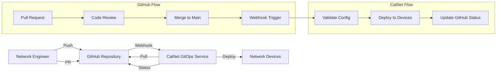
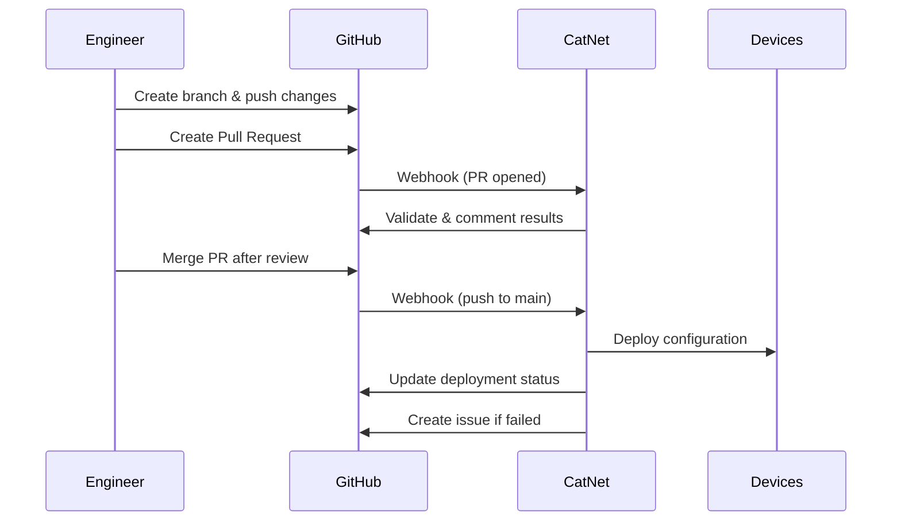

# GitHub Integration with CatNet

## Overview

CatNet provides deep GitHub integration for GitOps-based network configuration management. This allows you to:
- Store all network configurations in GitHub
- Trigger deployments via Git commits
- Review changes through Pull Requests
- Maintain configuration history
- Rollback using Git history

## Architecture



## Setup Guide

### 1. Repository Structure

Create a GitHub repository with this structure:

```
network-configs/
├── .github/
│   ├── workflows/
│   │   └── catnet-validate.yml    # GitHub Actions for validation
│   └── CODEOWNERS                  # Require reviews for critical configs
├── devices/
│   ├── routers/
│   │   ├── core/
│   │   │   ├── router1.cfg
│   │   │   └── router2.cfg
│   │   └── edge/
│   │       ├── edge1.cfg
│   │       └── edge2.cfg
│   └── switches/
│       ├── switch1.cfg
│       └── switch2.cfg
├── templates/
│   ├── base_router.j2
│   └── base_switch.j2
├── policies/
│   ├── security.yaml
│   └── compliance.yaml
└── catnet.yaml                     # CatNet configuration
```

### 2. CatNet Configuration File

Create `catnet.yaml` in your repository root:

```yaml
version: 1
github:
  repository: "yourorg/network-configs"
  branch: main
  auto_deploy: true
  require_approval: true

deployment:
  strategy: canary
  stages:
    - percentage: 10
      wait_minutes: 5
    - percentage: 50
      wait_minutes: 10
    - percentage: 100

validation:
  pre_deploy:
    - syntax_check
    - security_scan
    - compliance_check
  post_deploy:
    - connectivity_test
    - service_verification

notifications:
  github:
    create_issues_on_failure: true
    update_pr_status: true
  slack:
    webhook: ${SLACK_WEBHOOK}

rollback:
  automatic: true
  on_failure_threshold: 5%
```

### 3. Connect GitHub to CatNet

#### Via CLI:
```bash
# Connect repository
python catnet_cli.py gitops connect \
  --repo https://github.com/yourorg/network-configs \
  --token ghp_your_github_token \
  --branch main

# Verify connection
python catnet_cli.py gitops status
```

#### Via API:
```python
import requests

# Connect GitHub repository
response = requests.post(
    "http://catnet.local/api/v1/gitops/connect",
    headers={"Authorization": f"Bearer {token}"},
    json={
        "repository_url": "https://github.com/yourorg/network-configs",
        "access_token": "ghp_your_github_token",
        "branch": "main",
        "auto_sync": True
    }
)
```

### 4. Configure GitHub Webhook

1. Go to your GitHub repository
2. Navigate to Settings → Webhooks
3. Add webhook:
   - **Payload URL**: `https://your-catnet.com/api/v1/gitops/webhook`
   - **Content type**: `application/json`
   - **Secret**: Generate with `openssl rand -hex 32`
   - **Events**: Select "Push events" and "Pull request events"

4. Add webhook secret to CatNet:
```bash
python catnet_cli.py gitops set-webhook-secret \
  --secret your_webhook_secret
```

### 5. GitHub Actions Integration

Create `.github/workflows/catnet-validate.yml`:

```yaml
name: CatNet Configuration Validation

on:
  pull_request:
    paths:
      - 'devices/**'
      - 'templates/**'
      - 'catnet.yaml'

jobs:
  validate:
    runs-on: ubuntu-latest
    steps:
      - uses: actions/checkout@v3

      - name: Setup CatNet CLI
        run: |
          pip install catnet-cli

      - name: Validate Configurations
        env:
          CATNET_API_URL: ${{ secrets.CATNET_API_URL }}
          CATNET_API_TOKEN: ${{ secrets.CATNET_API_TOKEN }}
        run: |
          catnet validate --all

      - name: Security Scan
        run: |
          catnet security scan --path devices/

      - name: Compliance Check
        run: |
          catnet compliance check --framework pci-dss --path devices/

      - name: Comment PR
        if: always()
        uses: actions/github-script@v6
        with:
          script: |
            const output = `
            ## CatNet Validation Results

            ✅ Syntax Check: Passed
            ✅ Security Scan: No issues found
            ✅ Compliance: PCI-DSS compliant

            Ready for deployment after merge.
            `;

            github.rest.issues.createComment({
              issue_number: context.issue.number,
              owner: context.repo.owner,
              repo: context.repo.repo,
              body: output
            });
```

## Workflow Examples

### 1. Standard Configuration Change



### 2. Emergency Rollback via Git

```bash
# Revert last commit
git revert HEAD
git push origin main

# CatNet automatically detects and applies rollback
# Or manually trigger:
python catnet_cli.py gitops rollback --commit HEAD~1
```

### 3. Scheduled Deployment via GitHub

Create `.github/workflows/scheduled-maintenance.yml`:

```yaml
name: Weekly Maintenance Window

on:
  schedule:
    - cron: '0 2 * * 6'  # Saturday 2 AM

jobs:
  deploy:
    runs-on: ubuntu-latest
    steps:
      - uses: actions/checkout@v3
        with:
          ref: maintenance-branch

      - name: Deploy Maintenance Configs
        run: |
          curl -X POST https://catnet.local/api/v1/gitops/deploy \
            -H "Authorization: Bearer ${{ secrets.CATNET_TOKEN }}" \
            -d '{"branch": "maintenance-branch", "strategy": "rolling"}'
```

## Pull Request Integration

### Automatic Validation Comments

CatNet automatically comments on PRs with validation results:

```markdown
## 🔍 CatNet Validation Report

### ✅ Syntax Validation
All configurations passed syntax validation.

### ⚠️ Security Scan
- **Warning**: SNMPv2 community string found in `router1.cfg:45`
- **Info**: Consider using SNMPv3 for better security

### ✅ Compliance Check (PCI-DSS)
Configuration is compliant with PCI-DSS requirements.

### 📊 Impact Analysis
- **Devices affected**: 3 (router1, router2, switch1)
- **Estimated deployment time**: 5 minutes
- **Risk level**: Low

### 🚀 Deployment Preview
After merge, this will be deployed using **canary** strategy:
- Stage 1: 10% of devices (1 device)
- Stage 2: 50% of devices (2 devices)
- Stage 3: 100% of devices (3 devices)

---
*Approve deployment after merge by commenting `/deploy` or wait for auto-deployment.*
```

### PR Status Checks

CatNet creates GitHub status checks:

```python
# CatNet automatically sets these statuses
statuses = [
    {
        "context": "catnet/syntax",
        "state": "success",
        "description": "Configuration syntax is valid"
    },
    {
        "context": "catnet/security",
        "state": "warning",
        "description": "Minor security concerns found"
    },
    {
        "context": "catnet/compliance",
        "state": "success",
        "description": "PCI-DSS compliant"
    }
]
```

## Advanced Features

### 1. Branch Protection Rules

Configure branch protection in GitHub:
- Require PR reviews before merge
- Require status checks (CatNet validation)
- Require up-to-date branches
- Include administrators

### 2. CODEOWNERS File

Create `.github/CODEOWNERS`:

```
# Network team owns all configs
/devices/ @yourorg/network-team

# Security team must review firewall configs
/devices/firewalls/ @yourorg/security-team

# Core routers need senior approval
/devices/routers/core/ @yourorg/senior-engineers
```

### 3. Deployment Environments

Use GitHub Environments for staged deployments:

```yaml
# .github/workflows/deploy.yml
jobs:
  deploy-staging:
    environment: staging
    steps:
      - name: Deploy to Staging
        run: catnet deploy --environment staging

  deploy-production:
    needs: deploy-staging
    environment: production
    steps:
      - name: Deploy to Production
        run: catnet deploy --environment production
```

### 4. Git Tags for Versioning

```bash
# Tag a stable configuration
git tag -a v1.0.0 -m "Stable network configuration"
git push origin v1.0.0

# Deploy specific version
python catnet_cli.py gitops deploy --tag v1.0.0

# Rollback to tagged version
python catnet_cli.py gitops rollback --tag v1.0.0
```

## API Endpoints for GitHub Integration

### Repository Management
```http
POST   /api/v1/gitops/repositories
GET    /api/v1/gitops/repositories
DELETE /api/v1/gitops/repositories/{id}
```

### Webhook Processing
```http
POST   /api/v1/gitops/webhook
GET    /api/v1/gitops/webhook/deliveries
POST   /api/v1/gitops/webhook/redeliver/{id}
```

### Synchronization
```http
POST   /api/v1/gitops/sync
GET    /api/v1/gitops/sync/status
POST   /api/v1/gitops/sync/force
```

### Deployment from Git
```http
POST   /api/v1/gitops/deploy
GET    /api/v1/gitops/deployments
POST   /api/v1/gitops/rollback
```

## Security Considerations

### 1. Token Security
- Use GitHub Personal Access Tokens with minimal scopes
- Store tokens in HashiCorp Vault
- Rotate tokens regularly

### 2. Webhook Security
- Always verify webhook signatures
- Use HTTPS endpoints only
- Implement rate limiting

### 3. Code Signing
- Sign commits with GPG
- Verify signatures before deployment
- Require signed commits for production

Example GPG setup:
```bash
# Configure Git to sign commits
git config --global user.signingkey YOUR_KEY_ID
git config --global commit.gpgsign true

# CatNet verification
python catnet_cli.py gitops require-signed-commits --enable
```

## Monitoring and Alerts

### GitHub to CatNet Metrics
- Webhook delivery success rate
- Sync frequency and duration
- Validation pass/fail rates
- Deployment trigger sources

### CatNet to GitHub Feedback
- Deployment status updates
- Issue creation on failures
- PR comment updates
- Commit status checks

## Troubleshooting

### Webhook Not Triggering

1. Check webhook delivery in GitHub:
   - Repository → Settings → Webhooks → Recent Deliveries

2. Verify webhook secret:
```bash
python catnet_cli.py gitops verify-webhook
```

3. Check CatNet logs:
```bash
python catnet_cli.py logs --service gitops --tail 100
```

### Sync Issues

```bash
# Force resync
python catnet_cli.py gitops sync --force

# Check sync status
python catnet_cli.py gitops status --verbose

# Reset Git integration
python catnet_cli.py gitops reset --confirm
```

### Permission Errors

Ensure GitHub token has required permissions:
- `repo` - Full repository access
- `workflow` - GitHub Actions access (if using)
- `webhook` - Webhook management

## Best Practices

1. **Use Pull Requests** for all changes
2. **Implement CODEOWNERS** for critical configs
3. **Enable branch protection** on main branch
4. **Sign commits** for production changes
5. **Tag stable versions** for easy rollback
6. **Use GitHub Environments** for staged deployments
7. **Implement GitHub Actions** for validation
8. **Monitor webhook delivery** health
9. **Document changes** in commit messages
10. **Regular backups** independent of Git

## Example Integration Script

```python
#!/usr/bin/env python3
"""
Complete GitHub integration setup for CatNet
"""

import os
import requests
from github import Github

def setup_github_integration():
    # Initialize GitHub client
    gh = Github(os.environ['GITHUB_TOKEN'])
    repo = gh.get_repo('yourorg/network-configs')

    # Create webhook
    webhook = repo.create_hook(
        name='web',
        config={
            'url': 'https://catnet.local/api/v1/gitops/webhook',
            'content_type': 'json',
            'secret': os.environ['WEBHOOK_SECRET']
        },
        events=['push', 'pull_request'],
        active=True
    )

    # Set up branch protection
    branch = repo.get_branch('main')
    branch.edit_protection(
        required_approving_review_count=2,
        enforce_admins=True,
        require_code_owner_reviews=True,
        required_status_checks={
            'strict': True,
            'contexts': ['catnet/validation']
        }
    )

    # Connect to CatNet
    catnet_response = requests.post(
        'https://catnet.local/api/v1/gitops/connect',
        json={
            'repository': repo.full_name,
            'webhook_id': webhook.id,
            'auto_deploy': True
        },
        headers={'Authorization': f"Bearer {os.environ['CATNET_TOKEN']}"}
    )

    print(f"✅ GitHub integration configured!")
    print(f"   Repository: {repo.full_name}")
    print(f"   Webhook ID: {webhook.id}")
    print(f"   CatNet: {catnet_response.json()}")

if __name__ == '__main__':
    setup_github_integration()
```

This integration enables a complete GitOps workflow where all network configuration changes flow through GitHub, providing version control, peer review, and automated deployment with full auditability.