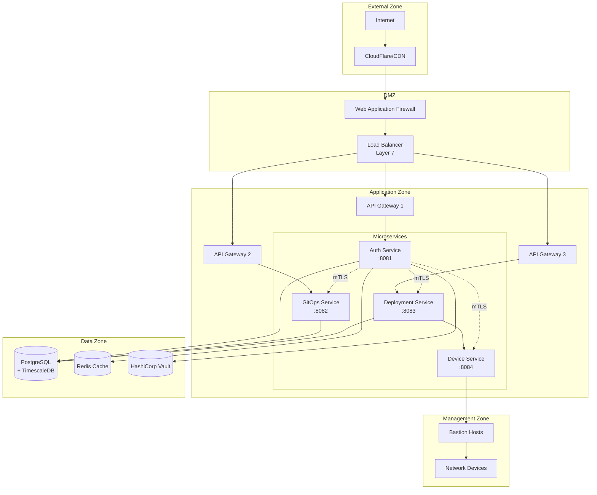
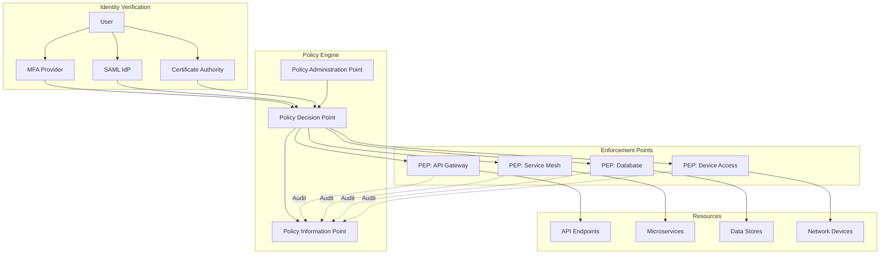
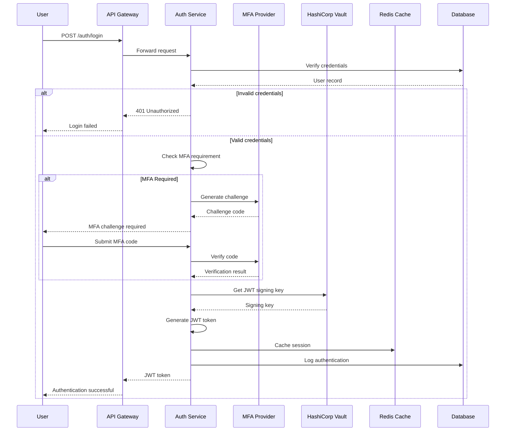
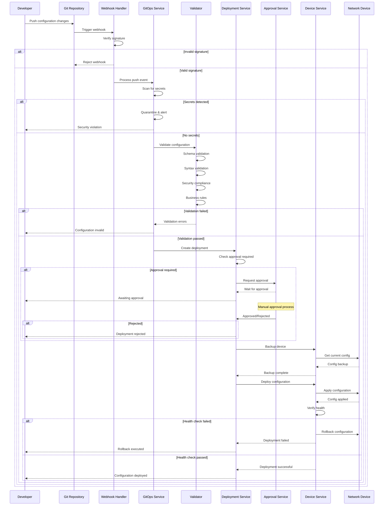
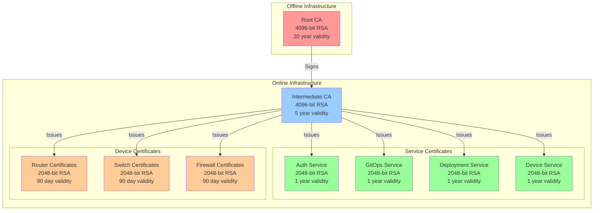
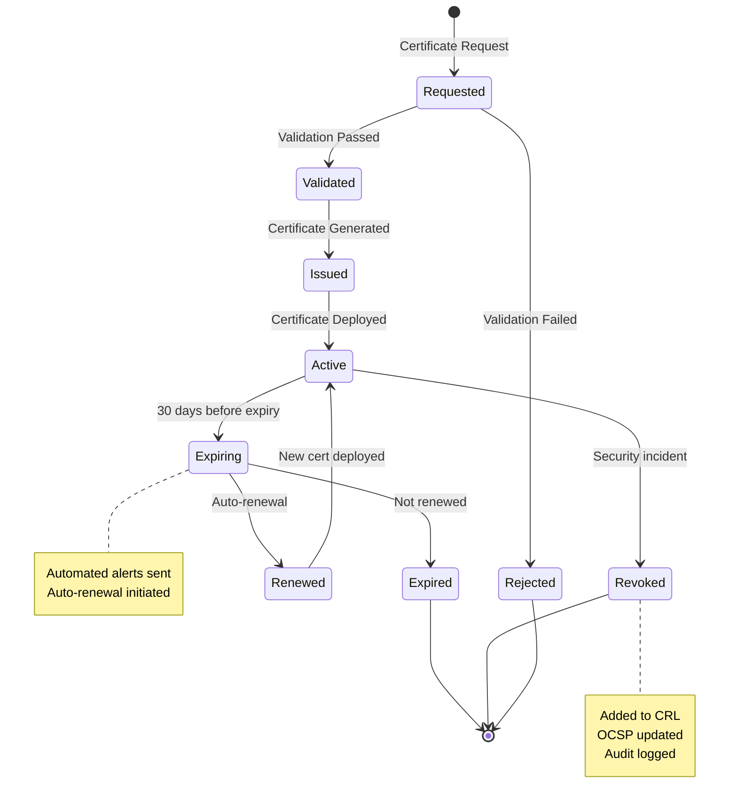
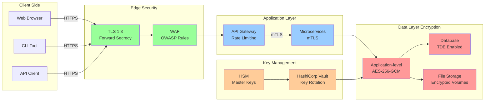
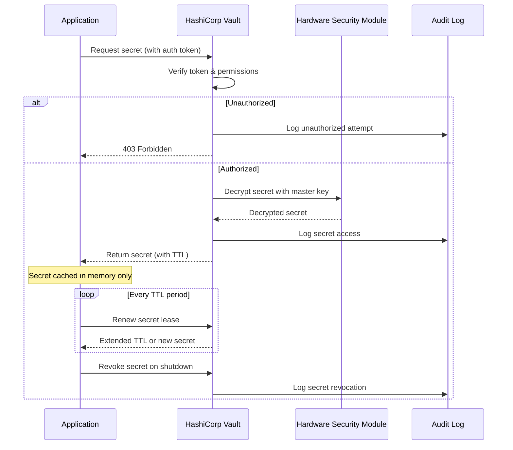

# CatNet Security Architecture

## Executive Summary
CatNet implements a defense-in-depth security architecture with zero-trust principles, ensuring comprehensive protection for network configuration management operations.

## Security Architecture Diagrams

### System Architecture Overview



### Zero-Trust Network Architecture



### Authentication Flow



### GitOps Deployment Flow



## Certificate Management

CatNet implements a comprehensive PKI infrastructure for device and service authentication.

### Certificate Hierarchy



### Certificate Lifecycle Management



## Data Flow Security

All data in CatNet is encrypted both at rest and in transit.

### Encryption Architecture



### Secrets Management Flow



## Security Layers

### 1. Perimeter Security

#### Components
- **Web Application Firewall (WAF)**
  - OWASP Top 10 protection
  - Custom rule sets for network management APIs
  - Geographic blocking capabilities
  - Rate limiting at edge

- **DDoS Protection**
  - Layer 3/4 volumetric attack mitigation
  - Layer 7 application attack protection
  - Auto-scaling during attacks
  - Traffic scrubbing centers

- **Intrusion Detection/Prevention System (IDS/IPS)**
  - Signature-based detection
  - Anomaly detection using ML
  - Automatic threat response
  - Integration with SIEM

### 2. Authentication & Authorization

#### Authorization Matrix

| Role | Devices | Deployments | Users | Audit | GitOps |
|------|---------|-------------|-------|-------|---------|
| Admin | Full | Full | Full | Full | Full |
| Operator | Read/Write | Create/Execute | Read | Read | Read/Write |
| Approver | Read | Approve | Read | Read | Read |
| Viewer | Read | Read | - | Read | Read |
| Auditor | Read | Read | Read | Full | Read |

### 3. Network Segmentation

```
┌─────────────────────────────────────────────────────────┐
│                     Internet (Untrusted)                 │
└────────────────────────┬─────────────────────────────────┘
                         │
                  ╔══════▼════════╗
                  ║  Firewall/IPS  ║
                  ╚══════╤════════╝
                         │
┌────────────────────────▼─────────────────────────────────┐
│                    DMZ (10.0.1.0/24)                     │
│  ┌──────────────────────────────────────────────────┐   │
│  │           Load Balancer / API Gateway            │   │
│  └──────────────────────────────────────────────────┘   │
└────────────────────────┬─────────────────────────────────┘
                         │
                  ╔══════▼════════╗
                  ║   Firewall    ║
                  ╚══════╤════════╝
                         │
┌────────────────────────▼─────────────────────────────────┐
│              Application Zone (10.0.2.0/24)              │
│  ┌─────────┐  ┌─────────┐  ┌─────────┐  ┌─────────┐   │
│  │  Auth   │  │ GitOps  │  │ Deploy  │  │ Device  │   │
│  │  Svc    │  │  Svc    │  │  Svc    │  │  Svc    │   │
│  └─────────┘  └─────────┘  └─────────┘  └─────────┘   │
└────────────────────────┬─────────────────────────────────┘
                         │
                  ╔══════▼════════╗
                  ║   Firewall    ║
                  ╚══════╤════════╝
                         │
┌────────────────────────▼─────────────────────────────────┐
│                Data Zone (10.0.3.0/24)                   │
│  ┌─────────┐  ┌─────────┐  ┌─────────┐  ┌─────────┐   │
│  │Database │  │  Redis  │  │  Vault  │  │ Storage │   │
│  └─────────┘  └─────────┘  └─────────┘  └─────────┘   │
└────────────────────────┬─────────────────────────────────┘
                         │
                  ╔══════▼════════╗
                  ║   Firewall    ║
                  ╚══════╤════════╝
                         │
┌────────────────────────▼─────────────────────────────────┐
│            Management Zone (10.0.4.0/24)                 │
│  ┌──────────────────────────────────────────────────┐   │
│  │            Network Devices (Isolated)            │   │
│  └──────────────────────────────────────────────────┘   │
└───────────────────────────────────────────────────────────┘
```

## Security Controls

### Preventive Controls

| Control | Implementation | Purpose |
|---------|---------------|---------|
| Input Validation | Pydantic models, regex patterns | Prevent injection attacks |
| Authentication | JWT, MFA, Certificates | Verify identity |
| Authorization | RBAC, ABAC | Enforce access control |
| Encryption | TLS, AES-256-GCM | Protect data confidentiality |
| Rate Limiting | Token bucket algorithm | Prevent abuse |
| CSRF Protection | Double-submit cookies | Prevent CSRF attacks |
| Security Headers | CSP, HSTS, X-Frame-Options | Browser security |

### Detective Controls

| Control | Implementation | Purpose |
|---------|---------------|---------|
| Audit Logging | Comprehensive event logging | Track activities |
| Monitoring | Prometheus, Grafana | Detect anomalies |
| IDS/IPS | Snort/Suricata | Detect intrusions |
| File Integrity | AIDE, Tripwire | Detect changes |
| Vulnerability Scanning | Trivy, Semgrep | Find vulnerabilities |
| Secret Scanning | GitLeaks | Detect exposed secrets |

### Corrective Controls

| Control | Implementation | Purpose |
|---------|---------------|---------|
| Automated Rollback | Deployment rollback | Restore service |
| Incident Response | Runbook automation | Quick recovery |
| Backup/Restore | Automated backups | Data recovery |
| Patching | Automated updates | Fix vulnerabilities |
| Key Rotation | Scheduled rotation | Limit exposure |

## Threat Model

### STRIDE Analysis

#### Spoofing
- **Threat**: Impersonation of legitimate users or services
- **Mitigation**: Strong authentication (MFA), certificate-based auth, JWT validation

#### Tampering
- **Threat**: Unauthorized modification of data or configurations
- **Mitigation**: Digital signatures, integrity checks, audit logging

#### Repudiation
- **Threat**: Users denying actions
- **Mitigation**: Non-repudiation through digital signatures, comprehensive audit logs

#### Information Disclosure
- **Threat**: Unauthorized access to sensitive data
- **Mitigation**: Encryption at rest and in transit, access controls, data classification

#### Denial of Service
- **Threat**: Service availability attacks
- **Mitigation**: Rate limiting, DDoS protection, auto-scaling, circuit breakers

#### Elevation of Privilege
- **Threat**: Unauthorized privilege escalation
- **Mitigation**: Least privilege, separation of duties, regular permission audits

### Attack Vectors & Mitigations

| Attack Vector | Likelihood | Impact | Mitigation |
|---------------|------------|--------|------------|
| SQL Injection | Low | High | Parameterized queries, ORM |
| XSS | Low | Medium | Input sanitization, CSP |
| CSRF | Low | Medium | CSRF tokens, SameSite cookies |
| Brute Force | Medium | Medium | Rate limiting, account lockout |
| Man-in-the-Middle | Low | High | mTLS, certificate pinning |
| Insider Threat | Medium | High | Audit logging, separation of duties |
| Supply Chain | Low | High | Dependency scanning, SBOM |
| Zero-Day | Low | Critical | Defense in depth, monitoring |

## Security Monitoring

### Security Metrics Dashboard

```
┌─────────────────────────────────────────────────────────────┐
│                   Security Operations Center                │
├──────────────┬──────────────┬──────────────┬──────────────┤
│Failed Logins │  Active      │ Certificate  │   Threat     │
│              │  Sessions    │   Expiry     │   Level      │
│     15       │     247      │   30 days    │    LOW       │
├──────────────┼──────────────┼──────────────┼──────────────┤
│ API Rate     │  Blocked     │  Encryption  │   Audit      │
│ Violations   │    IPs       │   Status     │   Events     │
│      3       │      12      │   100% OK    │   1,247      │
└──────────────┴──────────────┴──────────────┴──────────────┘

Real-time Alerts:
• [WARN] Multiple failed login attempts from 192.168.1.100
• [INFO] Certificate rotation completed for device-group-1
• [INFO] New deployment approved by user admin@catnet.local
```

### Security Event Correlation

```
Event Stream → Correlation Engine → Pattern Detection → Alert Generation
      │              │                     │                │
      ▼              ▼                     ▼                ▼
 [Raw Events]  [Normalize]          [ML Analysis]    [SIEM/SOAR]
```

## Incident Response Plan

### Response Phases

1. **Detection & Analysis**
   - Alert triggered
   - Initial assessment
   - Severity classification
   - Team activation

2. **Containment**
   - Isolate affected systems
   - Preserve evidence
   - Prevent spread

3. **Eradication**
   - Remove threat
   - Patch vulnerabilities
   - Update signatures

4. **Recovery**
   - Restore services
   - Monitor for recurrence
   - Verify functionality

5. **Post-Incident**
   - Lessons learned
   - Process improvement
   - Documentation update

## Security Compliance

### Compliance Framework Coverage

| Framework | Coverage | Certification Status |
|-----------|----------|---------------------|
| NIST 800-53 | 95% | In Progress |
| SOC 2 Type II | 100% | Ready for Audit |
| PCI DSS | 100% | Compliant |
| GDPR | 100% | Compliant |
| HIPAA | N/A | Not Required |
| ISO 27001 | 90% | Planned |

### Security Assurance

- **Penetration Testing**: Quarterly
- **Vulnerability Assessments**: Monthly
- **Security Audits**: Annually
- **Code Reviews**: Every commit
- **Security Training**: Quarterly

## Security Tools Integration

### SIEM Integration
```python
# Splunk/ELK Integration
siem_forwarder = {
    "host": "siem.catnet.local",
    "port": 514,
    "protocol": "TLS",
    "format": "CEF",
    "events": ["authentication", "authorization", "security"]
}
```

### SOAR Playbooks
```yaml
playbook: suspicious_login
triggers:
  - multiple_failed_logins
  - unusual_location
  - impossible_travel
actions:
  - block_ip
  - disable_account
  - notify_security_team
  - create_incident_ticket
```

## Security Best Practices

### Development Security

1. **Secure Coding**
   - Input validation
   - Output encoding
   - Parameterized queries
   - Error handling
   - Secure defaults

2. **Code Analysis**
   - Static analysis (SAST)
   - Dynamic analysis (DAST)
   - Dependency scanning
   - Container scanning
   - Infrastructure as Code scanning

3. **Security Testing**
   - Unit tests for security
   - Integration security tests
   - Penetration testing
   - Fuzzing
   - Chaos engineering

### Operational Security

1. **Access Management**
   - Least privilege
   - Regular access reviews
   - Privileged access management
   - Just-in-time access
   - Break-glass procedures

2. **Change Management**
   - Security review for changes
   - Approval workflows
   - Rollback procedures
   - Change tracking
   - Impact analysis

3. **Incident Management**
   - 24/7 monitoring
   - Incident response team
   - Communication plan
   - Evidence preservation
   - Post-incident review

## Future Security Enhancements

### Planned Improvements

| Enhancement | Timeline | Priority |
|-------------|----------|----------|
| Zero Trust Network Access (ZTNA) | Q1 2026 | High |
| AI-based Anomaly Detection | Q2 2026 | Medium |
| Blockchain Audit Logs | Q3 2026 | Low |
| Quantum-resistant Cryptography | Q4 2026 | Medium |
| Homomorphic Encryption | 2027 | Low |

---

## Security Contacts

| Role | Responsibility | Contact |
|------|---------------|---------|
| CISO | Security Strategy | ciso@catnet.local |
| Security Architect | Architecture Design | architect@catnet.local |
| SOC Manager | Security Operations | soc@catnet.local |
| Incident Response Lead | Incident Management | ir@catnet.local |

---

*Last Updated: 2025-09-17*
*Classification: Confidential*
*Version: 1.0*